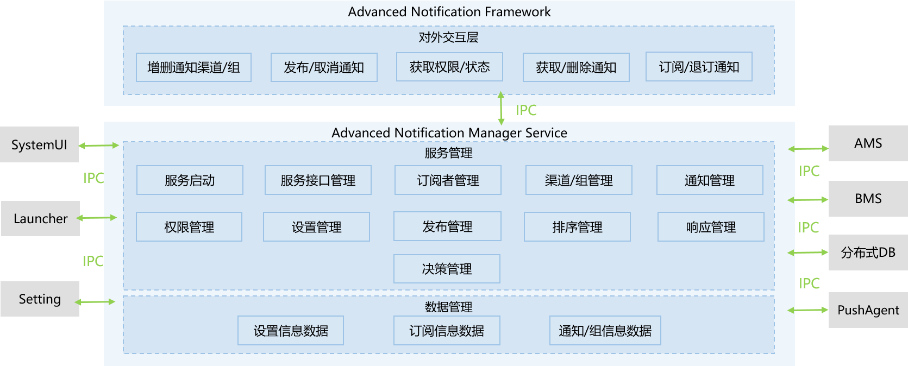

# 事件通知子系统

## 简介

OpenHarmony通过ANS（Advanced Notification Service，通知系统服务）对通知类型的消息进行管理，支持多种通知类型，包括文本，长文本，多文本，图片，社交，媒体等。所有系统服务以及应用都可以通过通知接口发送通知消息，用户可以通过SystemUI查看所有通知消息。

通知常见的使用场景：

- 显示接收到短消息、即时消息等。
- 显示应用的推送消息，如广告、版本更新等。
- 显示当前正在进行的事件，如导航、下载等。

### 架构图



## 目录

```
/base/notification/ans_standard/
├── frameworks   # 接口实现
├── interfaces
│   ├── innerkits    # 对内接口目录
│   └── kits         # 对外接口目录
├── sa_profile   # 组件服务配置
├── services     # 组件服务实现
└── tools        # 组件工具实现

```

## 使用说明

ANS支持4种类型的通道，分别为：
- 社交通讯
- 服务提醒
- 内容资讯
- 其他

应用开发者可以根据使用场景创建通道。通道创建后，提醒方式均为系统默认提醒方式。终端用户可以通过设置应用调整各通道的提醒方式。

应用开发者发可发布以下类型的通知：
- 普通文本
- 长文本
- 图片
- 多行文本
- 社交

并且可调整通知的分发时间、角标数字、分组、触发事件等属性。

## 相关仓

事件通知子系统

**notification_ans_standard**

[aafwk\_standard](https://gitee.com/openharmony/aafwk_standard)

[appexecfwk\_standard](https://gitee.com/openharmony/appexecfwk_standard)

[distributeddatamgr\_datamgr](https://gitee.com/openharmony/distributeddatamgr_datamgr)